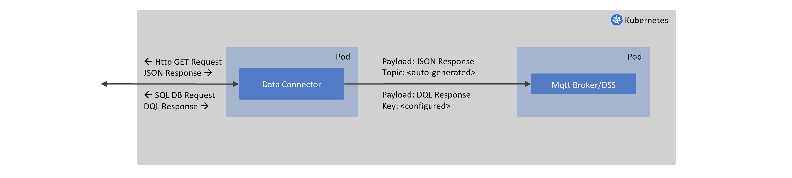

# Http Mqtt Connector

A repo to periodically read data from RESTful APIs and publish it on MQTT broker.

## Overview



## Features

1. Poll RESTful endpoints using ```GET``` verb.
2. Configurable polling interval for RESTful endpoints.
3. MQTT connectivity using anonymous, username/password or SAT token in Azure IoT Operations. [WIP]

## Backlog

Please refer to the project board [here](https://github.com/users/suneetnangia/projects/3).

## Development Loop

[](https://codespaces.new/suneetnangia/http-mqtt-connector/)

## Deploy in K8s

1. Add Helm Repo:

    ```helm repo add aio-extensions https://raw.githubusercontent.com/suneetnangia/http-mqtt-connector/release_management```

2. Copy configuration file from the example [here](docs/AppSettings.md#Example%20appsettings.json).

3. Update configuration file with your specifics, refer to the guide [here](docs/AppSettings.md#Configuration%20Guide).

4. Install Helm package (appsettings.json content is stored as a K8s secret):

    ```helm install http-mqtt-connector-01 aio-extensions/http-mqtt-connector --namespace azure-iot-operations --create-namespace --set-file appsettingsContent=$pwd./<path to your>/appsettings.json```

5. Uninstall Helm package (after evaluation):

    ```helm uninstall http-mqtt-connector-01 -n azure-iot-operations```
